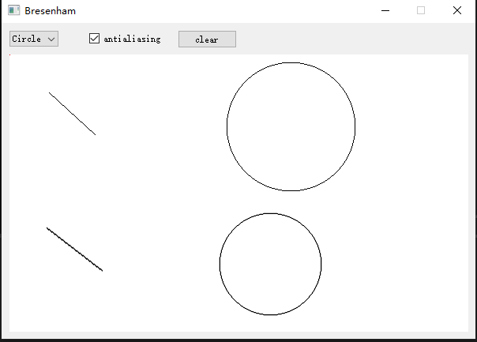

## 程序介绍

使用qt实现使用Bresenham算法绘制直线和圆，并实现了简单的反走样。

就直线为例，得到直线的起点和终点，然后生成要绘制的所有的像素点，使用QPainter.drawPoints()绘制所有的点。
## 算法简介

Bresenham是一种十分高效的光栅化直线算法。

* 选择增长速度快的坐标，每次增加一个像素单位，如在1/8圆域内，选择x， 每一次x++
* 设置一个判断量d， 根据d的大小来决定下一个像素的y不变或者是y++
* di+1 可由di求得， d的大小不同，di+1求得的方法不同
* 可以将浮点运算转换为整数运算，速度很快
## 开发环境
* vs 2019
* qt 5.12.3

## 程序使用

下面的图形使用了反走样技术。（效果并不是很明显）

准备条件：选中Circle或者Line，选中antialiasing确定是否使用反走样。

绘制：
画线：鼠标左键点击起点，右键点击终点绘制
画圆：鼠标左键点击中心点，右键点击点确定为边上任意一点

点击clear按钮清空画板

## 分析与总结

Bresenham算法使用了整数加减法，效率较高。注意画直线要区分不同的象限和斜率。画圆可以先画八分之一圆。

反走样技术如果考虑线的宽度比较复杂，所以我只是参考一篇论文实现了简单的反走样。

## 参考资料

[1]刘建国,张晔.Bresenham画线反走样算法[J].计算机与现代化,2005(02):10-11+13.