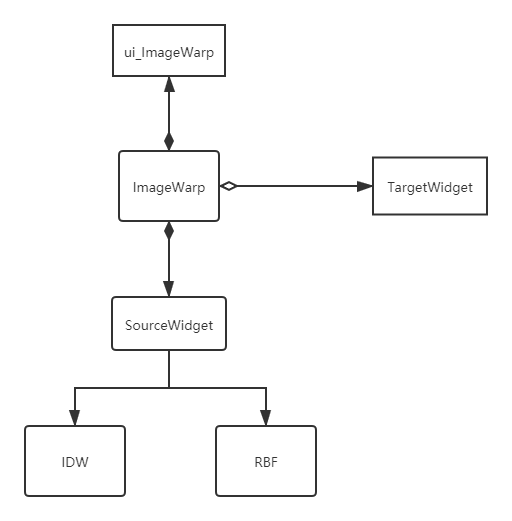
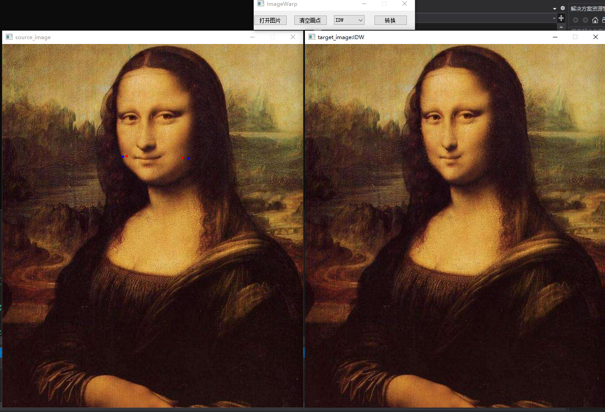
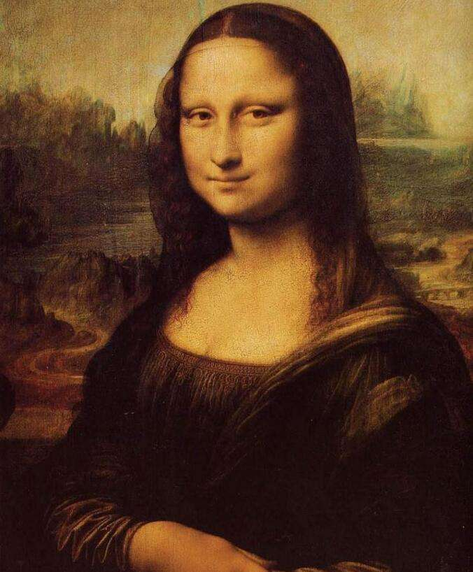
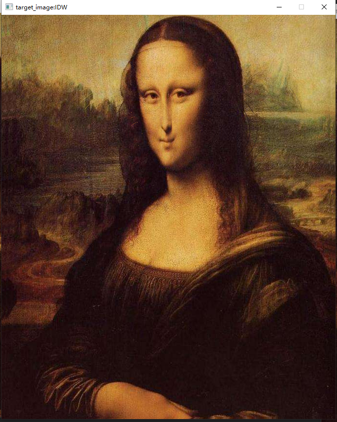
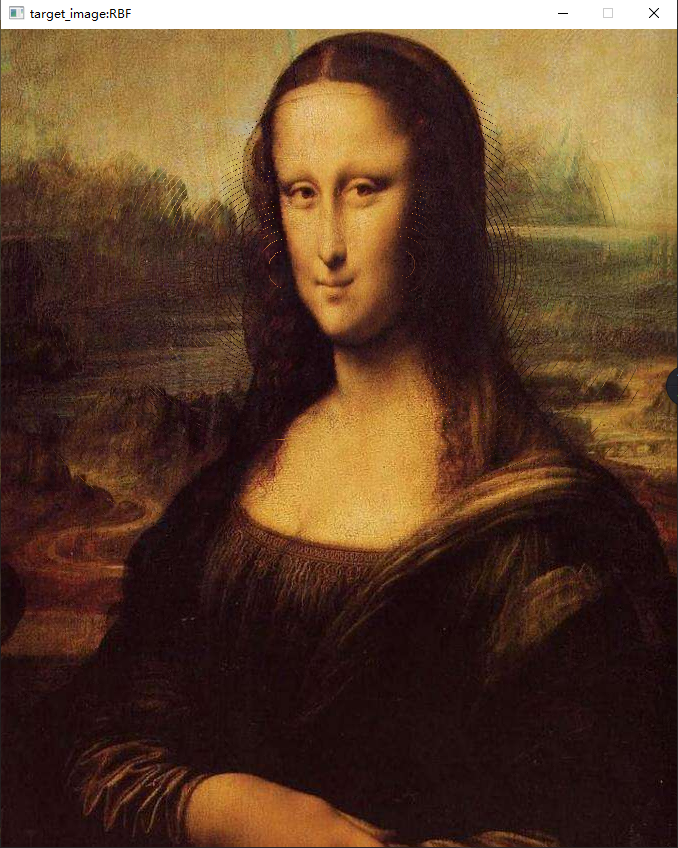

2020-10-20 congcong
## 介绍
根据论文Image Warping with Scattered Data Interpolation实现了ImageWarp的IDW和RBF算法，并使用qt实现了GUI。

## 类图

## 开发环境
* vs 2019
* qt 5.12.3
* Eigen 3.8

## 操作

点击打开图片出现source_widget窗口，左键点击蓝点，右键点击红点，选择算法后，点击转换，出现一个新的窗口显示生成的照片。

## 效果
原始图像：

IDW:

RBF:

## 不足

（1）	没有实现IDW中T矩阵
（2）	没有对最后的画面撕裂修补的很完美
