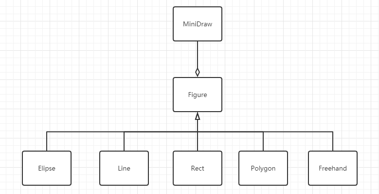
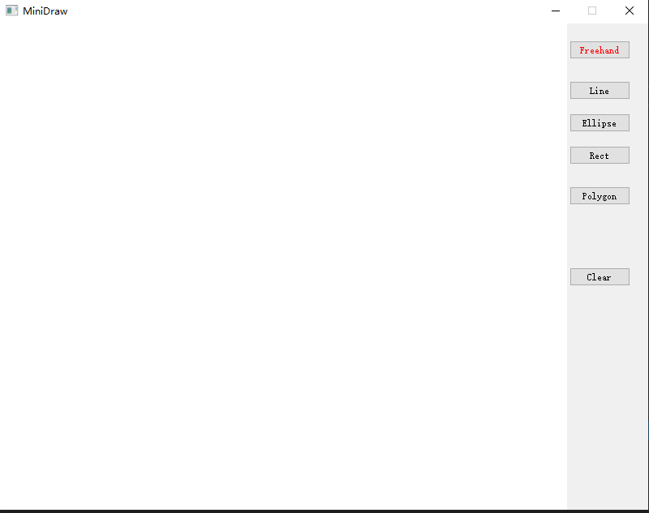
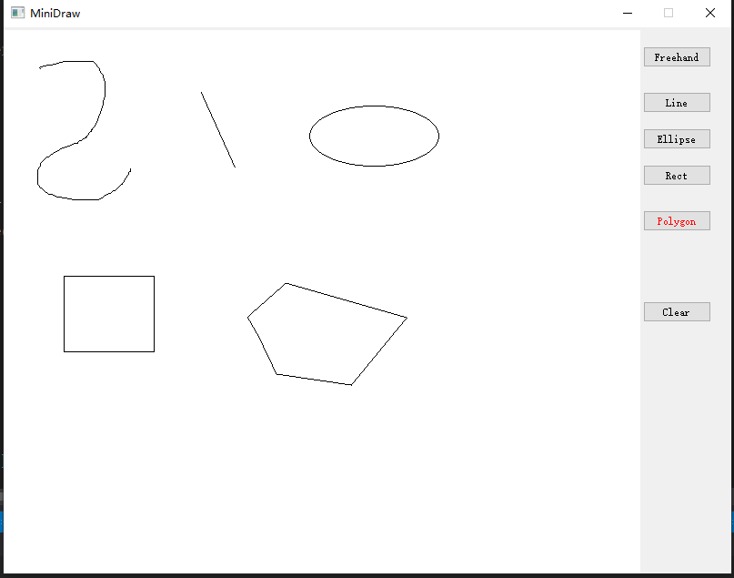

2020/10/5 by congcong

## 介绍

熟悉QT图形界面。

使用鼠标绘制直线、矩形、椭圆、多边形和自由绘制。

## 开发环境

* vs 2019
* qt 5.12.3
* c++

## 项目结构

## 操作
直线、椭圆、矩形和多边形：点击鼠标左键画板上出现蓝色的点，点击鼠标右键出现红色的点，点自动连成线。

自由绘制：使用鼠标左键点击后移动自动绘制，松开鼠标绘制结束。

## 界面展示

